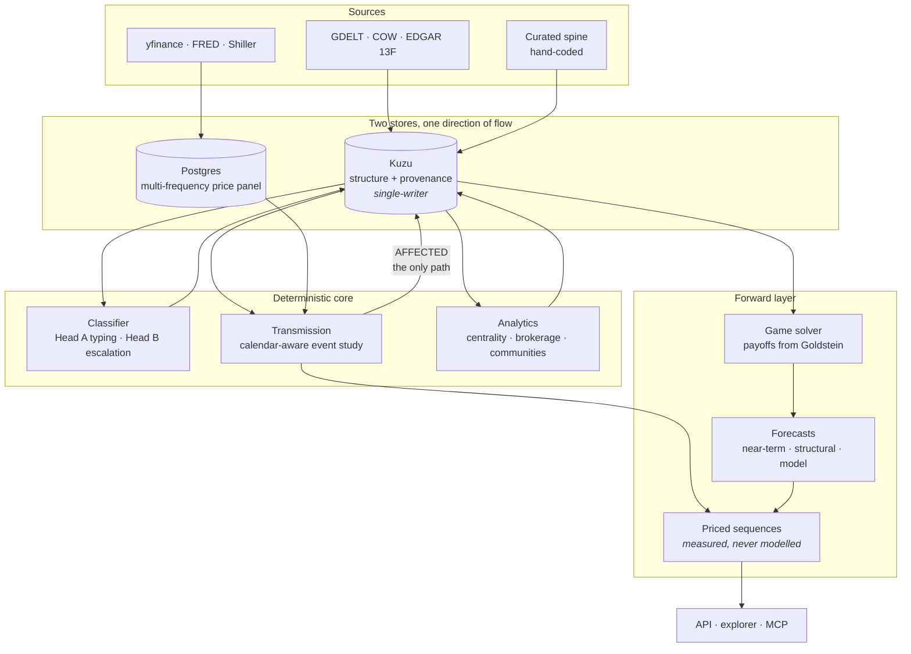

<div align="center">

# GeoGraph

**An applied-history engine for geopolitics and markets.**

*A 120-year network archive. A transmission layer that measures what events did to prices.
A reasoning layer that argues forward — and never originates a number.*

<br>

[](https://www.python.org/)
[-8250df?style=flat-square)](https://kuzudb.com/)
[](https://www.postgresql.org/)
[](https://linkml.io/)
[](https://fastapi.tiangolo.com/)
[](https://vitejs.dev/)

[](#verification)
[](#verification)
[](#verification)
[](#the-archive)
[](#region-packs)

<br>

[**Design spec**](docs/build-spec.md) · [**Game layer**](docs/game-spec.md) · [**Learned layer**](docs/ml-spec.md) · [**OOS validation**](docs/oos-spec.md)

</div>

---

It operationalizes applied history at the scale of the *longue durée* — networks
over hierarchies, analogy only within comparable regimes, and honesty about
uncertainty enforced in code rather than in prose.

Sibling project to **MarketGraph**, from which it inherits its foundation: a
LinkML ontology as the single source of truth, Kuzu as the embedded knowledge
graph, the same provenance invariant, and the same zero-drama Railway deploy.

> **`docs/build-spec.md` is the master spec and every decision in it is locked.**
> This README is the door, not the argument.

---

## The invariant everything is built around

> Every sourced edge — `INITIATED_BY`, `DIRECTED_AT`, `RELATES_TO`, `AFFECTED`,
> `FLOW` — carries a `source_id` that resolves to a `Source` that **exists**.

Kuzu has no `NOT NULL` on relationship properties, so this is enforced in code:
`validate_edge` runs inside `merge_edges`, which is the *only* edge-write path
in the system. Sources are written **before** the edges that cite them — that
ordering is the foreign key being satisfied.

Three corollaries that shape everything downstream:

| Rule | Meaning |
|---|---|
| **Drop and count** | A loader never infers a fact to tidy a parse failure. |
| **Crosswalks, not inference** | Deep-tier records map deterministically, never through an LLM. |
| **The AI never originates a number** | Not in `AFFECTED`, not in `NetworkMetric`, not in the deterministic half of a `Forecast`. It narrates and argues; the core measures. |

---

## How it fits together



**Numbers cross panel → graph in exactly one direction**, through
`transmission.effects.write_effects`. Nothing else writes `AFFECTED`.

---

## What makes it different

<table>
<tr><td width="50%" valign="top">

### The fidelity gradient is first-class

The deep past is event-rich and market-data-poor. Every `Event` carries its
tier and temporal resolution; every `AFFECTED` edge carries the resolution it
was *measured* at; every `Market` carries its `inception_date`.

So the engine **skips markets that did not exist at event time** and records
the skip, and coarse history is down-weighted rather than treated as equal
evidence to a daily CAR.

</td><td width="50%" valign="top">

### The link to money is shown, not asserted

A deterministic event study computes abnormal returns per event per market,
calendar-aware — Gulf markets trade Sun–Thu, US Mon–Fri, and they share no
session.

Abqaiq (Saturday, 2019-09-14) is the canonical case: Tadawul reacts Sunday,
the US on Monday. `first_mover` is real information, not bookkeeping.

</td></tr>
<tr><td valign="top">

### Escalation is relational, not absolute

A −6.0 Goldstein event is *routine* for a rivalry and a *rupture* for an
alliance. Head B keeps a per-dyad EWMA baseline and scores
`magnitude = |score − baseline|`.

Same score, different dyad, different classification.

</td><td valign="top">

### Two forecast modes, honestly separated

**Near-term (0–3y)** — calibrated probabilistic scenarios, Brier-scored.
**Long-horizon (5–20y)** — structural pressure over windows, never dated
predictions, retrodicted rather than scored.

Every long-horizon output carries its boundary statement, and the scorer
*refuses* scenarios without likelihoods rather than mis-scoring them.

</td></tr>
</table>

---

## Quick start

```bash
pip install -e ".[dev,api]"          # add ,panel,analysis,ingest,reasoning,mcp,gen
python scripts/seed_pack.py mena     # regimes → actors → markets → spine
python -m core.api.app               # API + explorer on :8000
```

<details>
<summary><b>Frontend, panel, and the rest</b></summary>

<br>

```bash
npm --prefix web install
npm --prefix web run dev             # Vite on :5173, proxies /api
npm --prefix web run build           # tsc --noEmit && vite build → web/dist
```

The Postgres panel is needed only for the transmission engine:

```bash
export DATABASE_URL=postgresql://...
python scripts/apply_schema.py       # Kuzu DDL + panel DDL
```

Every setting is optional configuration — see `.env.example`. The agent surface
runs over stdio:

```bash
python -m core.mcp.server
```

</details>

### Verification

```bash
pytest              # 340 tests · no database, no network
ruff check .        # E,F,I,UP,B,SIM · line-length 100
mypy .              # strict, minus disallow_any_expr
```

---

## The archive

| | |
|---|---|
| **Span** | 1905 → present |
| **Event spine** | hand-coded through the CAMEO → Goldstein crosswalk |
| **Wire** | GDELT, from the free raw files — no BigQuery project required |
| **Deep tier** | COW state system · MIDs · CINC · alliances · IGOs · Shiller monthly |
| **Flows** | sovereign-wealth 13F positions from EDGAR |

> [!WARNING]
> **Density is uneven, and that is the archive's defining hazard.** The wire is
> dense; the years on either side hold a curated spine. Percentile-ranking a
> six-event window against a five-thousand-event one once pinned a pressure
> index at an all-time high and it was an artifact, not a finding.
>
> Four separate statistics have been distorted by this. Every estimator now
> carries a minimum-sample floor, reports its coverage, and refuses to average
> over fewer terms than it claims. **Check the sample behind any number here.**

### Region packs

Packs are a **contract**: the core runs unchanged, and nothing in `core/` may
special-case a region name.

| Pack | Captioned | Reach |
|---|---|---|
| `mena` | MENA | the pack that proved the model |
| `china` | **ASIA** | China, Taiwan, Japan, Korea |
| `eurasia` | EURASIA | Russia, Europe, and the stepland |

> A pack's **key** is not its caption. `packs/china` is captioned ASIA but stays
> keyed `china` — the key is written into artifact filenames and into the
> deployed volume, so renaming it is a data migration, not a label change.

---

## Layout

```
core/ontology/     LinkML schema (source of truth) · Kuzu DDL derivation · crosswalks
core/graph/        Kuzu store + network analytics
core/panel/        Postgres price panel (multi-frequency) + event-study set
core/ingestion/    deep tier: COW, ICB, JST, Shiller · modern: GDELT, prices, 13F
core/classifier/   Head A event typing · Head B escalation (deterministic)
core/transmission/ the event study — where geopolitics is measured against money
core/reasoning/    regimes · analogy · sensor loop · two forecast modes · calibration
core/games/        payoff estimation · equilibrium · duration · priced sequences
core/models/       the learned layer — gated WITHIN dyad, never pooled
core/api/          FastAPI  ·  core/mcp/  MCP server (agent surface)
packs/             mena · china · eurasia
web/               Vite + React + Tailwind explorer with the 120-year time slider
```

---

## Design notes worth knowing before you touch anything

<details>
<summary><b>The surface is set on paper — do not "restore" a dark theme</b></summary>

<br>

A deliberate, cited deviation from build-spec §15, which specifies a near-black
ground. The landing reads as a broadsheet front page, and a dark app beside it
read as two products — so the print language carries the whole surface:
parchment ground, ink text, masthead rules, dot-leader ledgers. §15's actual
requirement (restrained, serious, one accent, nothing decorative) is honoured
in full; its ground and text are inverted. The comment at the top of
`web/src/styles.css` is the citation.

Two consequences: the **3D canvas stays dark**, because the categorical actor
colours were validated against a dark surface; and `--accent` / `--alert` carry
the **sign of a number**, so they are a diverging pair rather than decoration.

</details>

<details>
<summary><b>Kuzu behaviours that fail silently</b></summary>

<br>

| Do not write | Why | Instead |
|---|---|---|
| `count(DISTINCT x)` and `sum(y)` in one `RETURN` | sum is NULL | two queries, join in Python |
| `sum(CASE WHEN ... END)` | NULL | arithmetic identities |
| `MATCH (n:A\|B)` | unsupported | `UNION ALL` per label |
| `RETURN n` across a `UNION` | node types differ per table | explicit scalar columns |
| `sum(x)` over `INT64` | Decimal → FastAPI serialises a JSON **string** | normalised at the store boundary |

`when` and `end` are reserved words — **including as query parameter names**, so
range filters use `$start_date` / `$end_date`. Postgres has the same class of
trap: `window` is reserved there, so the panel's column is `effect_window`.

**Closing a graph is not optional hygiene.** Each open database reserves 8 TiB
of virtual address space, so one process can hold about fifteen before
`kuzu.Database` fails with an error that names memory rather than the real
cause.

</details>

<details>
<summary><b>Dates are strings, on purpose</b></summary>

<br>

ISO-8601, stored as text. Deep-tier events may only know their year, and
ISO-8601 sorts lexically — so range logic works identically at every
resolution. This is not a bug to be fixed with a date type.

</details>

<details>
<summary><b>The learned layer is gated within dyad</b></summary>

<br>

A pooled score on this archive is not evidence. The label's variance is ~70%
within dyad and ~30% between, so a model that knows only *which dyad it is
looking at* scores AUC 0.92 pooled while ranking that dyad's own quarters
**backwards** (0.35).

So the target is a *deviation* from the dyad's running baseline, and so are the
features. The shipped model uses three of the nine features it computes —
measured, not chosen. And persistence is not the baseline, it is the signal
(+0.4253 within dyad; nothing beat it), so the gate asks the model to *keep*
persistence's ordering and beat its error.

</details>

---

<div align="center">
<sub>

`docs/build-spec.md` is the master spec · every decision in it is locked
<br>
cite the section when you deviate, and never deviate silently

</sub>
</div>
