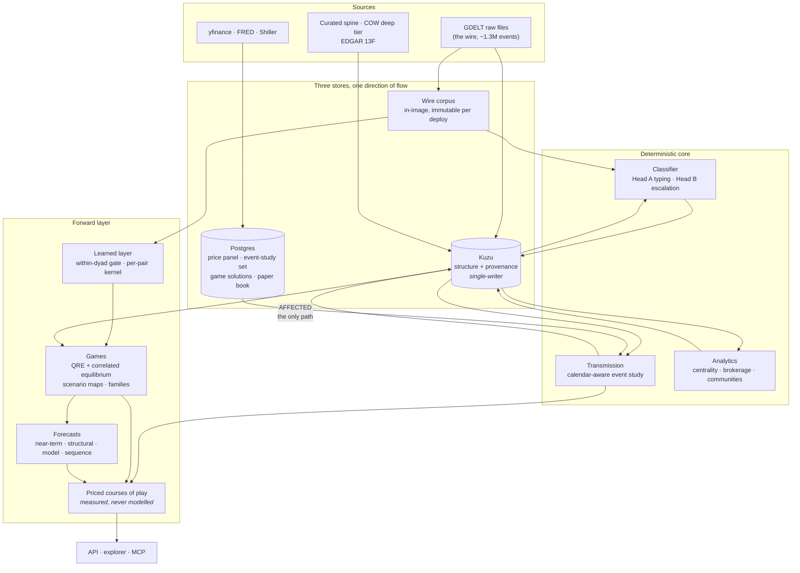

<div align="center">

# GeoGraph

**An applied-history engine for geopolitics and markets.**

*A network archive from 1972 to the live wire. A transmission layer that measures what events did to prices.
A game layer that solves what happens next — and a rule that the AI never originates a number.*

<br>

[](https://www.python.org/)
[-8250df?style=flat-square)](https://kuzudb.com/)
[](https://www.postgresql.org/)
[](https://linkml.io/)
[](https://fastapi.tiangolo.com/)
[](https://vitejs.dev/)

[](#verification)
[](#verification)
[](#verification)
[](#the-archive)
[](#region-packs)

</div>

---

GeoGraph operationalizes applied history at the scale of the *longue durée*:
networks over hierarchies, analogy only within comparable regimes, and honesty
about uncertainty enforced in code rather than in prose. It is a sibling of
**MarketGraph** and inherits its foundation — a LinkML ontology as the single
source of truth, Kuzu as the embedded knowledge graph, one provenance
invariant, one Railway deploy.

> Every structural decision here is locked in a design spec that lives with the
> maintainers; the code cites its sections. This README is the door, not the
> argument.

---

## The invariant everything is built around

> Every sourced edge — `INITIATED_BY`, `DIRECTED_AT`, `RELATES_TO`, `AFFECTED`,
> `FLOW` — carries a `source_id` that resolves to a `Source` that **exists**.

Kuzu has no `NOT NULL` on relationship properties, so this is enforced in code:
`validate_edge` runs inside the store's edge writers, which are the *only*
edge-write paths in the system. Sources are written **before** the edges that
cite them — that ordering is the foreign key being satisfied.

| Rule | Meaning |
|---|---|
| **Drop and count** | A loader never infers a fact to tidy a parse failure. |
| **Crosswalks, not inference** | Deep-tier records map deterministically, never through an LLM. |
| **The AI never originates a number** | Not in `AFFECTED`, not in `NetworkMetric`, not in the deterministic half of a `Forecast`, not in a solved game. It narrates and argues; the core measures. |

---

## How it fits together



**Numbers cross panel → graph in exactly one direction**, through
`transmission.effects.write_effects`. Nothing else writes `AFFECTED`.

**The wire corpus is not the graph.** The GDELT wire is served as a corpus — a
pure function of the artifacts shipped in the image — because every bulk
reader of it is a `GROUP BY dyad ORDER BY time`, not a traversal. The graph
keeps what is graph-shaped: actors, regimes, relations, the curated spine,
measured effects, network metrics, frozen forecasts.

**Recurring work runs inside the API.** A convergence loop of bounded,
resumable jobs (`core/api/jobs.py`, `core/api/work.py`) loads the wire,
scores it, measures the backlog, re-solves the games, re-freezes and scores
the forecasts, and warms the caches — behind a FIFO reader-writer lock, so
the archive converges while the site serves and a deploy is only for code.
Status at `/api/jobs`.

---

## What makes it different

<table>
<tr><td width="50%" valign="top">

### The fidelity gradient is first-class

The deep past is event-rich and market-data-poor. Every `Event` carries its
tier and temporal resolution; every `AFFECTED` edge carries the resolution it
was *measured* at; every `Market` carries its `inception_date`.

So the engine **skips markets that did not exist at event time** and records
the skip, and coarse history is down-weighted rather than treated as equal
evidence to a daily CAR.

</td><td width="50%" valign="top">

### The link to money is shown, not asserted

A deterministic event study computes abnormal returns per event per market,
calendar-aware — Gulf markets trade Sun–Thu, US Mon–Fri, and they share no
session.

Abqaiq (Saturday, 2019-09-14) is the canonical case: Tadawul reacts Sunday,
the US on Monday. `first_mover` is real information, not bookkeeping.

</td></tr>
<tr><td valign="top">

### Escalation is relational, not absolute

A −6.0 Goldstein event is *routine* for a rivalry and a *rupture* for an
alliance. Head B keeps a per-dyad EWMA baseline and scores
`magnitude = |score − baseline|`.

Same score, different dyad, different classification. The game's state
space and the learned layer's target inherit the same rule: a departure from
the pair's **own** baseline.

</td><td valign="top">

### Games that say which game they are

Every active pair in a region is solved under two stage concepts — the
fitted quantal response and an entropy-regularised correlated equilibrium
(reporting its `nash_gap`) — over a transition kernel that knows which pair
it is for. Courses of play are named as scenarios, priced to measured
effects, and each pair is classified **ally / rival / adversary** so a treaty
alliance is not narrated as brinkmanship.

</td></tr>
<tr><td valign="top">

### Four forecast modes, honestly separated

**Near-term** — base-rate scenarios, Brier-scored once the horizon closes.
**Long-horizon** — structural pressure over windows, retrodicted, never a
dated prediction. **Model** — the gated learned layer's trajectory.
**Sequence** — the solved game's courses.

Every long-horizon output carries its boundary statement, and the scorer
*refuses* scenarios without likelihoods rather than mis-scoring them.

</td><td valign="top">

### The learned layer is gated within dyad

A pooled score on this archive is not evidence — 70% of the label's variance
is within dyad. A model that only knows *which* dyad it is looking at scores
AUC 0.92 pooled while ranking that dyad's own quarters backwards. So targets
and features are deviations from the dyad's running baseline, and nothing
ships without beating persistence within dyad.

</td></tr>
</table>

---

## Quick start

```bash
pip install -e ".[dev,api]"          # add ,panel,analysis,ingest,reasoning,mcp,gen
python scripts/seed_pack.py mena     # sources → regimes → actors → markets → spine
python -m core.api.app               # API + explorer on :8000
```

<details>
<summary><b>Frontend, panel, and the rest</b></summary>

<br>

```bash
npm --prefix web install
npm --prefix web run dev             # Vite on :5173, proxies /api
npm --prefix web run build           # tsc --noEmit && vite build → web/dist
```

The Postgres panel is needed for the transmission engine, the games'
persisted solutions and the paper book:

```bash
export DATABASE_URL=postgresql://...
python scripts/apply_schema.py       # Kuzu DDL + panel DDL
```

Every setting is optional configuration — see `.env.example`. The agent
surface runs over stdio:

```bash
python -m core.mcp.server
```

</details>

### Verification

```bash
pytest              # 458 tests · no database, no network
ruff check .        # E,F,I,UP,B,SIM · line-length 100
mypy .              # strict, minus disallow_any_expr
```

---

## The archive

| | |
|---|---|
| **Span** | 1972 → present (cited deviation from a 1905 floor: the fiat-floating regime every pack market actually trades in) |
| **Event spine** | hand-coded through the CAMEO → Goldstein crosswalk |
| **Wire** | GDELT, from the free raw files — no BigQuery project required |
| **Deep tier** | COW state system · MIDs · CINC · alliances · IGOs · Shiller monthly |
| **Flows** | sovereign-wealth 13F positions from EDGAR |
| **Effects** | one `AFFECTED` edge per measured event × market × window; skips recorded |

> [!WARNING]
> **Density is uneven, and that is the archive's defining hazard.** The wire is
> dense and now tilts toward the recent years; the deep past holds a curated
> spine. Percentile-ranking a six-event window against a five-thousand-event
> one once pinned a pressure index at an all-time high and it was an artifact,
> not a finding. Every estimator carries a minimum-sample floor, reports its
> coverage, and refuses to average over fewer terms than it claims.
> **Check the sample behind any number here.**

### Region packs

Packs are a **contract**: the core runs unchanged, and nothing in `core/` may
special-case a region name.

| Pack | Captioned | Reach |
|---|---|---|
| `mena` | MENA | the pack that proved the model |
| `china` | **ASIA** | China, Taiwan, Japan, Korea |
| `eurasia` | EURASIA | Russia, Europe, and the stepland |

> A pack's **key** is not its caption. `packs/china` is captioned ASIA but stays
> keyed `china` — the key is written into artifact filenames and into the
> deployed volume, so renaming it is a data migration, not a label change.

---

## Layout

```
core/ontology/     LinkML schema (source of truth) · Kuzu DDL derivation · crosswalks
core/graph/        Kuzu store (the one door: lock, validation, writers) + network analytics
core/panel/        Postgres price panel · event-study set · game solutions · paper book
core/wire/         the GDELT corpus — parsed once per process, served, never traversed
core/ingestion/    deep tier: COW, Shiller · modern: GDELT, prices, 13F
core/classifier/   Head A event typing · Head B escalation (deterministic)
core/transmission/ the event study — where geopolitics is measured against money
core/reasoning/    regimes · analogy · sensor loop · forecast modes · calibration
core/games/        state · kernel · payoffs · QRE + CE solvers · paths · pricing · scenarios · families
core/models/       the learned layer — features, forecaster, per-pair dynamics; gated WITHIN dyad
core/api/          FastAPI · the convergence loop (jobs.py, work.py) · routers
core/mcp/          MCP server (agent surface) — a subpackage so it cannot shadow the SDK
packs/             mena · china · eurasia
models/            committed, hashed artifacts: intensity, per-region game fits, dynamics
data/derived/      the GDELT artifacts the corpus is a function of
scripts/           boot, seed, load, measure, fit, train, solve, backtest — all CLIs over core
web/               Vite + React explorer: Explorer · Relationships · Game theory · Markets · Watchlist · Case studies
```

---

## Design notes worth knowing before you touch anything

<details>
<summary><b>The surface is white paper — do not "restore" a dark theme</b></summary>

<br>

A deliberate, cited deviation from build-spec §15, which specifies a near-black
ground. The landing reads as a broadsheet front page and a dark app beside it
read as two products, so the print language carries the whole surface: white
ground, black ink, masthead rules, dot-leader ledgers, a white knowledge-graph
plate with a black border. §15's actual requirement — restrained, serious, one
accent, nothing decorative — is honoured in full. The comment at the top of
`web/src/styles.css` is the citation.

`--accent` / `--alert` carry the **sign of a number** (gain/loss,
de-escalation/escalation), so they are a diverging pair rather than
decoration; re-validate them against the ground before changing either.

</details>

<details>
<summary><b>Kuzu behaviours that fail silently</b></summary>

<br>

| Do not write | Why | Instead |
|---|---|---|
| `count(DISTINCT x)` and `sum(y)` in one `RETURN` | sum is NULL | two queries, join in Python |
| `sum(CASE WHEN ... END)` | NULL | arithmetic identities |
| `MATCH (n:A\|B)` | unsupported | `UNION ALL` per label |
| `RETURN n` across a `UNION` | node types differ per table | explicit scalar columns |
| `sum(x)` over `INT64` | Decimal → FastAPI serialises a JSON **string** | normalised at the store boundary |
| `MERGE` a rel whose destination side is a few nodes | walks a huge adjacency list and dies in storage | `kuzu_store.write_edges` |

`when` and `end` are reserved words — **including as query parameter names**, so
range filters use `$start_date` / `$end_date`. Postgres has the same class of
trap: `window` is reserved there, so the panel's column is `effect_window`.

**Every graph statement goes through `core/graph/kuzu_store.py`** — a test
refuses a bare `conn.execute` anywhere else — because that is where the
process-wide FIFO reader-writer lock lives, and Kuzu's post-write checkpoint
needs it. **Closing a graph is not optional hygiene**: each open database
reserves 8 TiB of virtual address space. **Size the buffer pool to the
cgroup, not the host**: Kuzu's default reads the host's RAM inside a container.

</details>

<details>
<summary><b>Dates are strings, on purpose</b></summary>

<br>

ISO-8601, stored as text. Deep-tier events may only know their year, and
ISO-8601 sorts lexically — so range logic works identically at every
resolution. This is not a bug to be fixed with a date type.

</details>

<details>
<summary><b>The learned layer is gated within dyad</b></summary>

<br>

The label's variance is ~70% within dyad and ~30% between, so a model that
knows only *which dyad it is looking at* scores AUC 0.92 pooled while ranking
that dyad's own quarters **backwards** (0.35). So the target is a *deviation*
from the dyad's running baseline, and so are the features. The shipped
forecaster uses three of the ten features it computes — measured, not chosen —
and the per-pair transition kernel enters the game as an offset on the counted
table, so a zero residual is the counted kernel exactly. Persistence is not the
baseline, it is the signal; the gate asks a model to *keep* its ordering and
beat its error.

</details>

<details>
<summary><b>The game is honest about which game it is</b></summary>

<br>

The solver's payoff is Fearon crisis bargaining — the right model for
adversaries, and the wrong one for treaty allies, to whom it was being applied.
`core/games/family.py` classifies each pair from what it **is** (the dated,
sourced `RELATES_TO` web) and how its record **reads** (the coercive share of
its coded events), and every solved dyad carries its family and, where the
solved game is not that family's own, a sentence saying so.
`core/games/family.py` names the families the archive can identify; the
adversary, ally and rival games each have their own action set and payoff.

</details>

---

Every locked decision is cited by section in the code that carries it. Cite
the section when you deviate, and never deviate silently.
